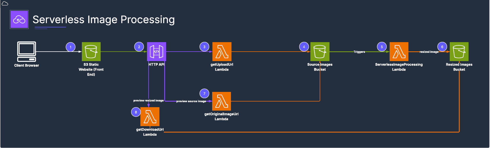

# 📷 Serverless Image Resizer

This project demonstrates a **fully serverless image processing solution** on AWS.

Users can:
- Upload an original image.
- Automatically generate a resized thumbnail.
- Preview both original and resized images securely.

## 🚀 Architecture Overview

**Components:**
- **Amazon S3**: Static website hosting (frontend), private source & destination buckets.
- **API Gateway HTTP API**: Generates pre-signed URLs for uploads and downloads.
- **AWS Lambda**:
  - `getUploadUrl`: Returns pre-signed URLs for secure upload.
  - `ServerlessImageProcessing`: Resizes uploaded images automatically.
  - `getDownloadUrl`: Returns pre-signed URLs to preview resized images.
  - `getOriginalImageUrl`: Returns pre-signed URLs to preview original images.

## 💻 Frontend

A clean HTML page hosted on S3 to allow:
- Uploading images.
- Previewing processed results.

## 🧩 Lambda Functions

All Lambda functions are included in the `/lambdas` directory.

Each function uses the **AWS SDK for JavaScript (v3)**.

## 🌐 API Endpoints

- `/upload-url`: Generate signed upload URL.
- `/download-url`: Generate signed preview URL for resized images.
- `/original-url`: Generate signed preview URL for original images.

## 🎥 Demo Video

Include a short video demonstration of the solution working end-to-end.
[Download demo video](./demo/demo.mkv)

